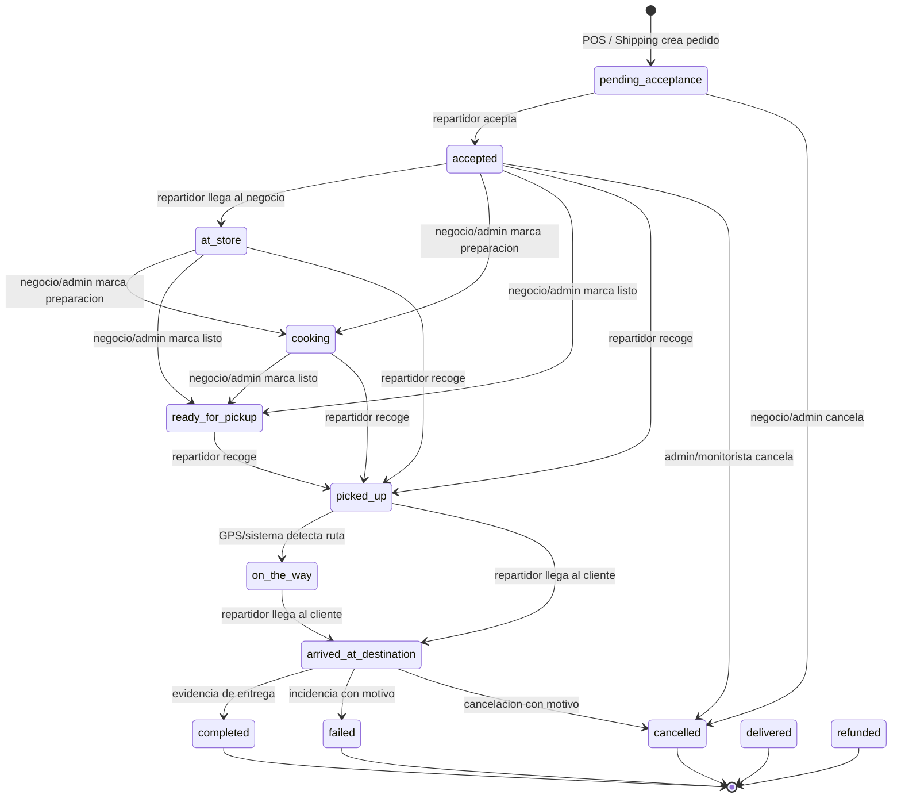
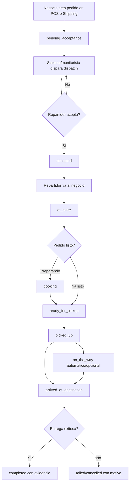

# Ciclo de vida homologado del pedido

Fecha de revision: 2026-05-04

Este documento homologa los estados que aparecen en la plataforma web, la app de repartidores y la base de datos. La fuente canonica queda alineada con el enum `grupohubs.order_status`.

## Estados canonicos

| Estado | Etiqueta operativa | Responsable principal | Accion que lo dispara | Nota |
| --- | --- | --- | --- | --- |
| `pending_acceptance` | Pendiente / sin asignar | Sistema, admin o monitorista | Se crea el pedido desde POS o Shipping | Todavia no hay repartidor asignado. |
| `accepted` | Aceptado | Repartidor | El repartidor acepta la solicitud | Inicia el traslado hacia el negocio. |
| `at_store` | En negocio | Repartidor | Marca que llego al negocio | Sirve para monitoreo y tiempos de espera. |
| `cooking` | En preparacion | Negocio, admin o monitorista | El negocio/admin marca que prepara el pedido | Opcional; aplica sobre todo a pedidos POS/comida. |
| `ready_for_pickup` | Listo para recoger | Negocio, admin o monitorista | El negocio/admin marca que el pedido esta listo | Opcional; el repartidor puede recoger desde este estado. |
| `picked_up` | Recogido | Repartidor | Marca que ya recogio el pedido | Estado recomendado para iniciar ruta al cliente. |
| `on_the_way` | En ruta | Sistema | GPS o automatizacion confirma movimiento despues de `picked_up` | Opcional. No debe ser una accion manual obligatoria del repartidor. |
| `arrived_at_destination` | En destino | Repartidor | Marca llegada con el cliente | Paso previo a cierre con evidencia o incidencia. |
| `completed` | Completado | Repartidor | Cierra entrega con foto/evidencia | Cierre exitoso nuevo para app, metricas e historial. |
| `delivered` | Entregado | Legacy / sistema | Datos historicos o cierre sin flujo nuevo | Se conserva como equivalente historico de `completed`. |
| `cancelled` | Cancelado | Negocio, admin o monitorista | Cancelacion operativa | Estado terminal. |
| `refunded` | Reembolsado | Admin o monitorista | Reembolso administrativo | Estado terminal. |
| `failed` | Fallido | Sistema, admin o monitorista | Error operativo o de pago | Estado terminal. |

## Diagrama de estados

## Flujo por actor

## Responsabilidades operativas

| Actor | Responsabilidades |
| --- | --- |
| Negocio | Crear pedido, confirmar detalle del pedido, marcar `cooking` y `ready_for_pickup` cuando aplique, cancelar si el pedido no procede. |
| Repartidor | Aceptar o rechazar, marcar `at_store`, `picked_up`, `arrived_at_destination` y cerrar como `completed` con evidencia. |
| Admin / monitorista | Supervisar dispatch, reasignar o relanzar busqueda, corregir estados manualmente, cancelar, reembolsar o marcar fallas operativas. |
| Sistema | Crear eventos, guardar timestamps por estado, enviar push a repartidores y web, calcular metricas. |

## Dispatch y reintentos

El pedido no necesita un estado nuevo cuando un repartidor rechaza o expira una solicitud. Debe permanecer o regresar a `pending_acceptance`, pero dejando trazabilidad operativa:

- `order_assignment_attempts`: registro por repartidor notificado con `outcome` (`notified`, `accepted`, `rejected`, `expired`, `superseded`), `dispatch_attempt_no`, algoritmo, score y distancia.
- `orders.dispatch_attempt_count`: contador resumen visible en plataforma y app.
- `orders.last_dispatch_at`: ultima vez que se intento asignar el pedido.
- `orders.rejected_riders`: lista de repartidores que rechazaron para evitar repetirlos en la misma busqueda.
- `orders.assignment_exhausted_at`: marca cuando ya no quedan candidatos disponibles.

## Incidencias en destino

Desde `arrived_at_destination` no se debe cerrar como `failed` o `cancelled` sin motivo. Si el cliente no contesta, el telefono es incorrecto, no abre o hay otra incidencia, se debe guardar:

- `orders.delivery_failure_reason`: motivo operativo capturado por repartidor, admin o monitorista.
- `orders.delivery_failure_reported_at`: fecha/hora del reporte.

Con esa informacion el admin o monitorista puede decidir si reintenta contacto, cancela, marca `failed` o genera seguimiento manual.

## Politica de alias heredados

- `completed` es el cierre exitoso recomendado desde ahora.
- `delivered` se conserva para datos historicos y se cuenta junto con `completed` en ingresos e historial.
- `out_for_delivery` se conserva como alias web heredado de "en ruta". El flujo nuevo debe preferir `picked_up` y, si se requiere un paso explicito de ruta, `on_the_way`.
- `on_the_way` debe dispararlo el sistema automaticamente cuando tenga senales de GPS posteriores a `picked_up`; si no existe esa automatizacion, la UI puede mostrar "En ruta" desde `picked_up` sin pedir otro boton al repartidor.

## Gaps encontrados antes de homologar

- La base ya tenia el enum amplio, pero la web solo reconocia `pending_acceptance`, `accepted`, `cooking`, `out_for_delivery`, `delivered` y `cancelled`.
- La app de repartidores ya usaba etapas finas en servicios y pantallas, pero el enum del modelo Dart estaba incompleto.
- Dashboard, monitoreo, historial de cliente, detalle de pedido y notificaciones web no contaban todos los estados activos y terminales.
- Las metricas de ingresos solo tomaban `delivered`; ahora deben contar `completed` y `delivered`.
